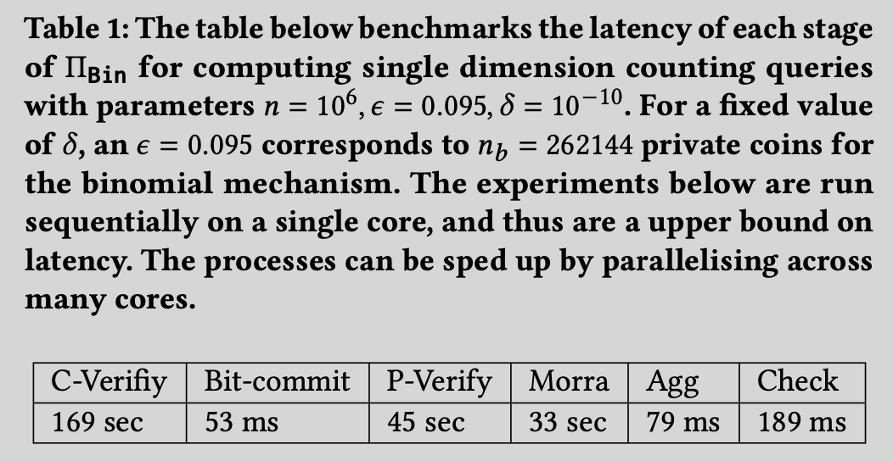

# Verifiable Differential Privacy

**NOTE:** This is not production ready code, used only for prototyping and generating numbers reported in the paper. To reproduce expriments in the paper see instructions below. 

**NOTE**: In this repository we simulate inter server communication in a single thread via a for loop. A more practical setting is to follow [this example](https://github.com/henrycg/heavyhitters) and setup multiple servers (and adapt the interface). For the purposes of this paper we did not find this necessary as it would lend us any new insights.

## Getting Started 

Make sure you have a working rust and cargo installation

```bash
$ rustc --version
rustc 1.63.0 (4b91a6ea7 2022-08-08)
$ cargo --version
cargo 1.63.0 (fd9c4297c 2022-07-01)
```

## Pedersen Commitments

Pedersen Commitments are the fundamental primitive used to implement further complex primitives in this paper. It is implemented on top of the [Ristretto Curve]() and details about implementation can be found in src/generic_commitments.rs

To estimate the time taken to commit to a single random 256 bit integer using a 256 bit random integer over the Ristretto curve, run the following command

```
cargo run --example commitment --release
```

# Generating Figures In the Paper

## Table I: Benchmarking Components For Each Phase of The Protocol

The experiments in this section could be embarassingly parallelised if needed. Thus the numbers reported here are pessimistic as they are estimates of sequential exeriments. Setting parameters: 
+ the number of clients $n=10^6$, 
+ privacy parameters $\epsilon=0.095$ and $\delta = 10^{-10}$, results in $\eta_b = 262144$ private coins.



### Aggregating Finite Field Elements

To change the parameters change $n, n_b$ in examples/aggregation.rs

```
cargo run --example aggregation --release

   Compiling dp_client v0.1.0 (/Users/aribiswas/projects/Verifiable-Differential-Privacy)
    Finished release [optimized] target(s) in 0.39s
     Running `target/release/examples/aggregation`
Time Taken to add 1000000 + 262144 = 1262144 integers; 79ms
```

### Proof Creation

The time taken to create a sigma proof for one private bit is 496 microseconds. The following script estimates the time to create $n_b=262144$ proofs sequentially
```
cargo run --example fiat_shamir_creation --release
```


### Proof Verification

The time taken to verify a sigma proof for one private bit is  401 microseconds. The following script estimates the time to verify $n_b=262144$ proofs sequentially

```
cargo run --example fiat_shamir_verification --release
```

### Aggregating Group Elements

Time Taken to add 1000000 + 262144 = 1262144 points in the ristretto curve; To change the parameters change $n, n_b$ in examples/com_aggregation.rs

```
cargo run --example com_aggregation --release
```

## Figure I: Latency vs Privacy Parameter


```
 cargo run --example privacy_vs_latency --release

    Finished release [optimized] target(s) in 0.15s
     Running `target/release/examples/privacy_vs_latency`
Time taken to sequentially create proofs for epsilon: 3.0438846293698814 or (256 coins) := 85 ms
Time taken to sequentially create proofs for epsilon: 2.1523514625769438 or (512 coins) := 103 ms
Time taken to sequentially create proofs for epsilon: 1.5219423146849407 or (1024 coins) := 204 ms
Time taken to sequentially create proofs for epsilon: 1.0761757312884719 or (2048 coins) := 408 ms
Time taken to sequentially create proofs for epsilon: 0.7609711573424703 or (4096 coins) := 819 ms 
...
```

This can take a while to run. Alternately, one can use the time taken to create/verify a single proof and extrapolate the time taken to run it $n$ times sequentially.

## Figure II: Comparison With Prio And Poplar

To get numbers for Prio and Poplar run the following commands. The numbers for the OR proof can be easily adapted from the scripts above

```
cargo run --example prio_simulation --release
cargo run --example poplar_simulation --release
```


